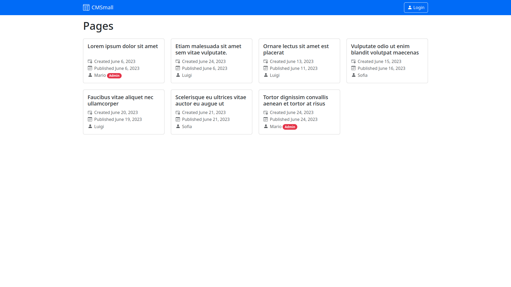
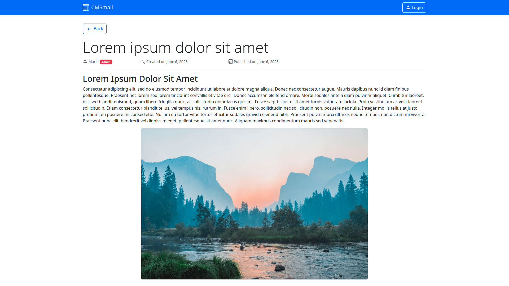
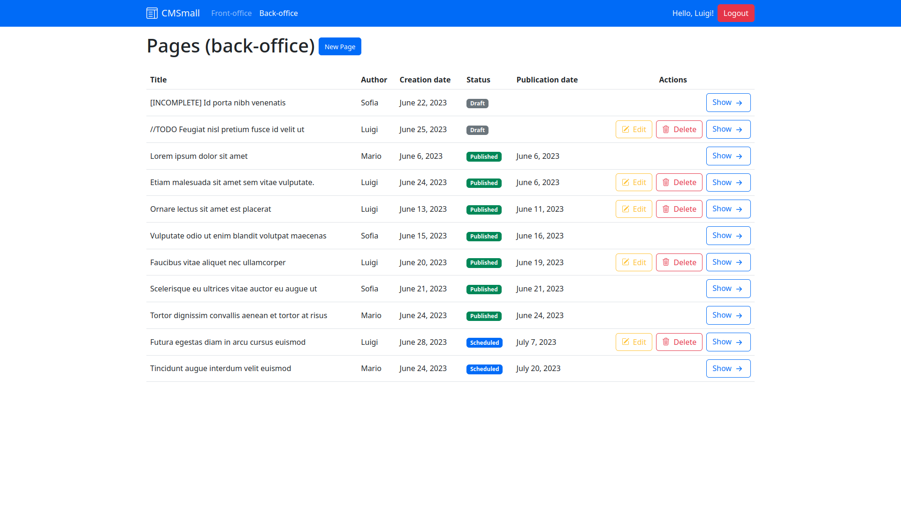
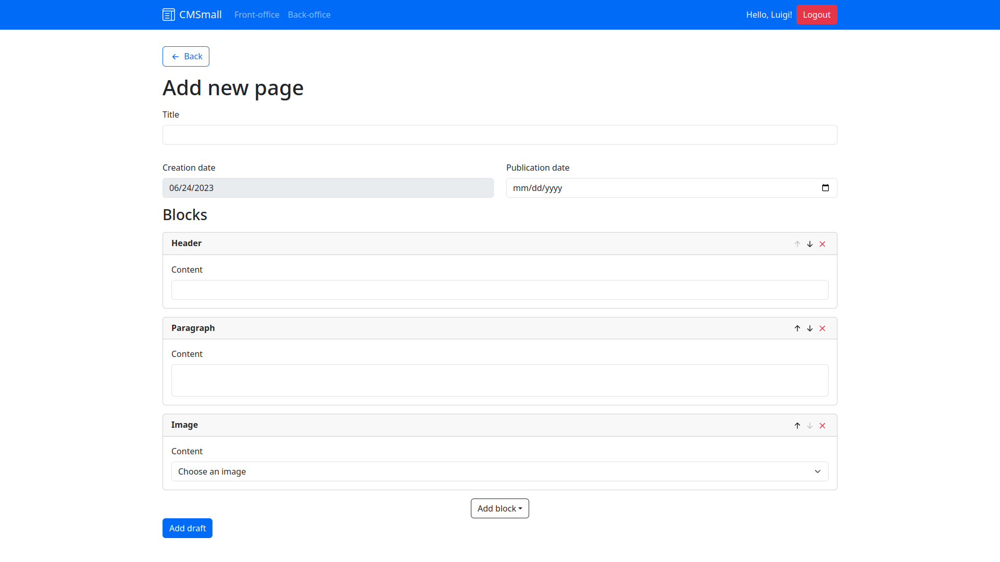

# Exam #1: "CMSmall"

## React Client Application Routes

- Route `/`: Redirects to `/front`.
- Route `/front`: Shows a list of pages contained in the front-office, that every (logged and non-logged) user can see. The information shown is limited (all except the page's blocks).
- Route `/back`: Shows a list of pages contained in the back-office, that only logged users can see. Like `/front`, the information shown is also limited.
- Route `/login`: Allows the user to log in through a form.
- Route `/pages/:id`: Shows a single page's content, including all its blocks. The page is identified by its `id`.
- Route `/pages/new`: Allows a logged user to add a new page through a form.
- Route `/pages/:id/edit`: Allows a logged user to edit an existing page (which they have access to).

## API Server

### Login

POST `/api/sessions`

**Description**: Allows the user to log in.

**Request body**:
```JSON
{
    "username": "mario@example.org",
    "password": "password"
}
```

**Responses**:
- `200 OK` on successful login.
- `401 Unauthorized` if the credentials are invalid.
- `500 Internal Server Error` for any server-side error.

**Response body**:
```JSON
{
  "id": 1,
  "username": "mario@example.org",
  "name": "Mario",
  "admin": 1
}
```

### Get current session

GET `/api/sessions/current`

**Description**: Gets session information of the user who is currently logged in.

**Request body**: *None*

**Responses**:
- `200 OK`
- `401 Unauthorized` if user is not authenticated.
- `500 Internal Server Error` for any server-side error.

**Response body**:
```JSON
{
  "id": 1,
  "username": "mario@example.org",
  "name": "Mario",
  "admin": 1
}
```

### Logout

DELETE `/api/sessions/current`

**Description**: Allows the user to log out.

**Request body**: *None*

**Responses**:
- `204 No Content`
- `500 Internal Server Error` for any server-side error.

**Response body**: *None*

### List pages

GET `/api/pages`

**Description**: Responds with limited information about all pages (all except blocks). This route is authenticated, so the pages may be different depending on what user is (eventually) logged in.

**Request body**: *None*

**Responses**:
- `200 OK`
- `500 Internal Server Error` for any server-side error.

**Response body**:
```JSON
[
  {
    "id": 1,
    "title": "Lorem Ipsum Dolor Sit Amet",
    "author": {
      "id": 1,
      "name": "Mario",
      "admin": 1
    },
    "creationDate": "2023-06-06",
    "publicationDate": "2023-06-06"
  },
  ...
]
```

### Get page

GET `/api/pages/:id`

**Description**: Responds with *all* information related to a page (including its blocks), given its ID.

**Request body**: *None*

**Responses**:
- `200 OK`
- `404 Not Found` if the page does not exist, or if the user (logged in or not) is not allowed to see the page.
- `500 Internal Server Error` for any server-side error.

**Response body**:
```JSON
{
  "id": 1,
  "title": "Lorem Ipsum Dolor Sit Amet",
  "author": {
    "id": 1,
    "name": "Mario",
    "admin": 1
  },
  "creationDate": "2023-06-06",
  "publicationDate": "2023-06-06",
  "blocks": [
    {
      "type": "header",
      "content": "Nulla gravida ornare nisi, vitae bibendum sem egestas eget."
    },
    {
      "type": "paragraph",
      "content": "Mauris consequat sem a diam egestas, quis commodo mi mattis. Maecenas hendrerit nulla nisl, a tincidunt nisi malesuada eu."
    },
    {
      "type": "image",
      "content": "landscape.jpg"
    },
    ...
  ]
}
```

### Add new page

POST `/api/pages`

**Description**: Creates a new page and associates its relative blocks. Responds with the IDs of the new page and blocks on success.

**Request body**:
```JSON
{
  "title": "Etiam malesuada sit amet sem vitae vulputate.",
  "publicationDate": "2023-06-06",
  "author": 1,
  "blocks": [
    {
      "type": "header",
      "content": "Nulla gravida ornare nisi, vitae bibendum sem egestas eget."
    },
    {
      "type": "paragraph",
      "content": "Mauris consequat sem a diam egestas, quis commodo mi mattis. Maecenas hendrerit nulla nisl, a tincidunt nisi malesuada eu."
    },
    {
      "type": "image",
      "content": "landscape.jpg"
    }
  ]
}
```
- `publicationDate` is optional.
- `author` must be equal to the logged user's id, unless they're an admin. If not specified, the API will assume it's the logged user.
- `blocks` is an array that contains the content blocks of the page, which must be specified in the desired order. It must have at least one block of type `header` and one block of another type.
- `blocks[i].type` can only be one of `header`, `paragraph`, `image`.

**Responses**:
- `201 Created`
- `401 Unauthorized` if the user is not authenticated.
- `422 Unprocessable Entity` if the request body is invalid.
- `500 Internal Server Error` for any server-side error.

**Response body**:
```JSON
{
  "id": 2,
  "blocks": [ 3, 4, 5 ]
}
```

### Edit existing page

PUT `/api/pages/:id`

**Description**: Edits an existing page, with its relative blocks. Responds with the IDs of *only* the newly added blocks, specified in the same order of the `blocks` array.

**Request body**:
```JSON
{
  "title": "Etiam malesuada sit amet sem vitae vulputate.",
  "publicationDate": "2023-06-06",
  "author": 1,
  "blocks": [
    {
      "id": 1,
      "type": "header",
      "content": "Nulla gravida ornare nisi, vitae bibendum sem egestas eget."
    },
    {
      "id": 2,
      "type": "paragraph",
      "content": "Mauris consequat sem a diam egestas, quis commodo mi mattis. Maecenas hendrerit nulla nisl, a tincidunt nisi malesuada eu."
    },
    {
      "type": "image",
      "content": "landscape.jpg"
    }
  ]
}
```
- `publicationDate` is optional.
- `author` is optional. It must be equal to the logged user's id, unless they're an admin. If not specified, the API will assume it's the logged user.
- `blocks` contains *all* the content blocks of the page, which must be specified in the desired order. It must have at least one block of type `header` and one block of another type.
- `blocks[i].id` is optional. If included, the API will assume that the `i`-th block is an existing one to be edited, otherwise it's a new one to be added. In the example above, the first two blocks are edited, whereas the last one is added. All the blocks belonging to the page whose IDs are not specified in the `blocks` array are deleted.
- `blocks[i].type` can only be one of `header`, `paragraph`, `image`.

**Responses**:
- `200 OK`
- `401 Unauthorized` if the user is not authenticated, or if they don't have permission to edit the page.
- `404 Not Found` if the page doesn't exist.
- `422 Unprocessable Entity` if the request body is invalid.
- `500 Internal Server Error` for any server-side error.

**Response body**:
```JSON
{
  "blocks": [ 3 ]
}
```

### Delete existing page

DELETE `/api/pages/:id`

**Description**: Deletes a page, with its relative blocks, given its ID.

**Request body**: *None*

**Responses**:
- `204 No Content`
- `401 Unauthorized` if the user is not authenticated, or if they don't have permission to delete the page.
- `404 Not Found` if the page doesn't exist.
- `500 Internal Server Error` for any server-side error.

**Response body**: *None*

### Get the website's name

GET `/api/website/name`

**Description**: Gets the current website's name.

**Request body**: *None*

**Responses**:
- `200 OK`
- `500 Internal Server Error` for any server-side error.

**Response body**:
```JSON
{
  "name": "CMSmall"
}
```

### Update the website's name

PUT `/api/website/name`

**Description**: Updates the website's name.

**Request body**:
```JSON
{
  "name": "My Website"
}
```

**Responses**:
- `204 No Content`
- `401 Unauthorized` if the user is not an admin.
- `500 Internal Server Error` for any server-side error.

**Response body**: *None*

### List all users

GET `/api/users`

**Description**: Gets information related to all registered users.

**Request body**: *None*

**Responses**:
- `200 OK`
- `401 Unauthorized` if the user is not an admin.
- `500 Internal Server Error` for any server-side error.

**Response body**:
```JSON
[
  {
    "id": 1,
    "name": "Mario",
    "admin": 1
  },
  ...
]
```

### List all images

GET `/api/images`

**Description**: Gets information related to all images saved on the server.

**Request body**: *None*

**Responses**:
- `200 OK`
- `401 Unauthorized` if the user is not authenticated.
- `500 Internal Server Error` for any server-side error.

**Response body**:
```JSON
[
  {
    "filename": "landscape.jpg",
    "name": "Landscape"
  },
  ...
]
```

### Error handling

For any non-OK response, the body will contain a short description of the error:
```JSON
{
  "error": "This is an error description"
}
```

The only exception is `422 Unprocessable Entity` responses, which have the following body:
```JSON
{
  "errors": [
    {
      "type": "field",
      "path": "field_name",
      "value": "Value of the field inside the request body, if included.",
      "msg": "This describes the error inside the field.",
      "location": "body"
    },
    ...
  ]
}
```

## Database Tables

- **`users`**(<u>`id`</u>, `name`, `mail`, `pswHash`, `pswSalt`, `admin`)

  Contains information about users.
  - `admin` is a boolean (can be either 0 or 1)

- **`pages`**(<u>`id`</u>, `title`, `creationDate`, `publicationDate`, `author`)

  Contains information about pages created by users.
  - `author` refers to the ID of a registered user.

- **`blocks`**(<u>`id`</u>, `type`, `content`, `page`, `order`)
  
  Contains blocks of content of each page.
  - `type` can be only one of `header`, `paragraph`, `image`.
  - `page` refers to the ID of the page that contains the block.
  - `order` is incremental and starts from 0.

- **`images`**(<u>`filename`</u>, `name`)

  Contains information about all static images saved on the server.

- **`website`**(<u>`name`</u>)
  
  Contains only the name of the website, which needs to be modified by an admin user.

## Main React Components

- `Navbar` (in `Navbar.jsx`): Shows a navbar which is constantly at the top of the screen. It shows/hides user information depending on whether the user is logged in.
- `LoginForm` (in `LoginForm.jsx`): Shows a form which allows the user to log in.
- `PageCard` (in `PageCard.jsx`): Shows limited information about a single page (does not show its blocks, that will be done by a separate component).
- `PageRow` (in `PageRow.jsx`): Like `PageCard`, but as the row of a table. If the logged user is either an admin or the author of the page, this component also shows an "Edit" and a "Delete" button.
- `PageList` (in `PageList.jsx`): Shows a list of pages as either `PageCard` or `PageRow` components, depending on the selected office (back or front).
- `Page` (in `Page.jsx`): Shows details of a single page (including its blocks).
- `PageForm` (in `PageForm.jsx`): Allows a logged-in user to add or edit a new page, including all of its blocks.
- `ManagementButtons` (in `ManagementButtons.jsx`): Shows an "Edit" and a "Delete" button to the user. The former redirects to the edit route of a page.
- `WebsiteNameForm` (in `WebsiteNameForm.jsx`): Allows an admin user to edit the name of the website. Shown in the `Navbar`.

## Screenshots

| | |
|-|-|
| **Front-office**              |              |
| **Front-office (page view)**  |  |
| **Back-office**               |                  |
| **New page form**             |                   |

## Users Credentials

| username            | password | admin   |
|---------------------|----------|---------|
| mario@example.org   | password | `true`  |
| luigi@example.org   | password | `false` |
| sofia@example.org   | password | `false` |
| giulia@example.org  | password | `false` |